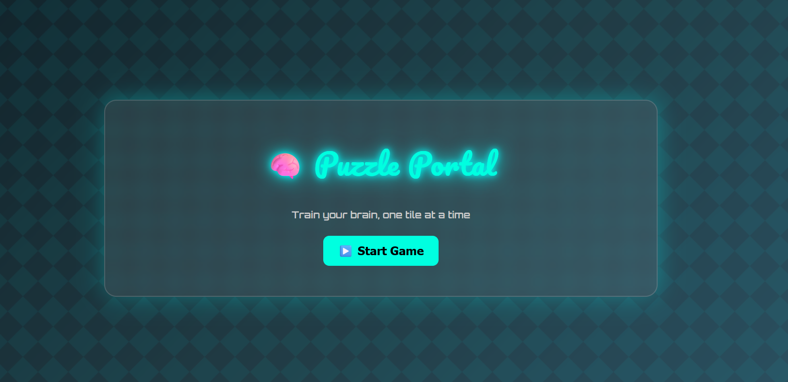
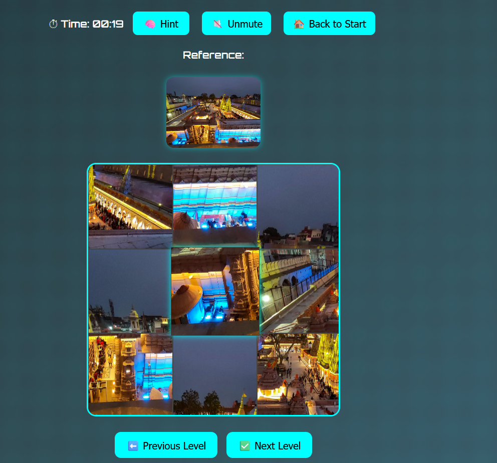

PUZZLE GAME:-
 
An interactive tile-based puzzle game to challenge your brain one tile at a time. Shuffle, swap, and solve the image before time runs out!

Features:-
Dynamic puzzle generation with increasing difficulty
Timer to test your speed
Reference image for guidance
Limited hints (20 per game) showing tile positions
Background music with mute/unmute control
Level progression with victory detection

📸 Screenshots :-

Tech Stack:-
HTML5
CSS3
Vanilla JavaScript

game will be live at:
